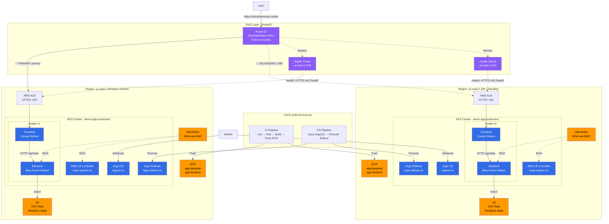

# My DevOps Project

[](https://www.terraform.io)
[](https://aws.amazon.com)
[](https://aws.amazon.com/eks)
[](https://argo-cd.readthedocs.io)
[](https://github.com/features/actions)
[](https://argoproj.github.io/argo-rollouts)

An **enterprise-style**, multi-environment DevOps platform on **AWS EKS** — demonstrating **GitOps** with Argo CD, **progressive delivery** via Argo Rollouts (Blue-Green + Canary), and full **Infrastructure as Code** with Terragrunt/Terraform.

---

## Highlights

- **5 environments** (dev → test → staging → perf → production) across **2 AWS regions** (us-east-1 primary + us-east-2 DR)
- **Multi-region DNS failover** via Route53 — automatic failover to us-east-2 if us-east-1 is unhealthy
- **HTTPS** with ACM certificates and custom domain [`cloudnativeops.online`](https://cloudnativeops.online)
- **GitOps** with Argo CD App-of-Apps — sync waves, multi-source apps, auto-sync + self-heal
- **Progressive delivery**: Blue-Green (backend) + Canary (frontend) via Argo Rollouts
- **Fully modular IaC**: Terragrunt DRY pattern with `_envcommon/` reusable modules
- **CI/CD**: GitHub Actions — lint → test → build → push ECR → ArgoCD sync → rollout promote
- **Secure**: IRSA (IAM Roles for Service Accounts) via OIDC — no static AWS credentials
- **Enterprise escape hatch**: `rollout.enabled: false` → standard Kubernetes Deployment
- **Local dev**: Docker Compose + MinIO (S3-compatible) — no cloud dependency


---

## Architecture



---

## Project Structure

```
my-devops-project/
├── app/                              # Application source code
│   ├── docker-compose.yaml           # Local dev with MinIO (S3-compatible)
│   ├── backend/
│   │   ├── app.py                    # Flask API: reads CSV from S3
│   │   ├── Dockerfile                # Python 3.12-slim + uv
│   │   └── pyproject.toml            # Dependencies (Flask, boto3)
│   └── frontend/
│       ├── app.py                    # Flask web UI: calls backend /api/data
│       ├── Dockerfile                # Python 3.12-slim + uv
│       ├── pyproject.toml            # Dependencies (Flask, requests)
│       └── templates/
│           └── index.html            # Jinja2 template rendering CSV table
│
├── helm-charts/                      # Helm charts (packaged with Argo CD)
│   ├── backend/                      # Backend chart (Blue-Green Rollout)
│   ├── frontend/                     # Frontend chart (Canary Rollout + Ingress)
│   └── alb-controller/               # ALB Controller wrapper chart
│
├── gitops/                           # Argo CD application manifests
│   ├── dev/                          # Development environment
│   ├── test/                         # Test environment
│   ├── staging/                      # Staging environment
│   ├── perf/                         # Performance environment
│   └── production/                   # Production (multi-region)
│       ├── us-east-1/                # Primary region
│       └── us-east-2/                # DR/secondary region
│
├── terraform/                        # Infrastructure as Code (Terragrunt)
│   ├── root.hcl                      # Shared config (provider, remote state)
│   ├── _envcommon/                   # Reusable environment-agnostic modules
│   │   ├── vpc.hcl                   # VPC with public/private subnets, NAT
│   │   ├── eks.hcl                   # EKS cluster + managed node groups
│   │   ├── ecr.hcl                   # ECR repositories
│   │   ├── iam.hcl                   # IAM roles for IRSA
│   │   ├── s3.hcl                    # S3 data source buckets
│   │   └── argocd.hcl                # Argo CD Helm deployment
│   ├── modules/
│   │   └── argocd/                   # Custom ArgoCD Terraform module
│   └── environments/                 # Per-environment configuration
│
└── .github/workflows/                # CI/CD pipelines
    ├── ci.yaml                       # Lint → Test → Build → Push ECR
    ├── cd.yaml                       # ArgoCD sync + Rollout promotion
    ├── terraform-apply.yaml          # Terraform apply workflow
    ├── terraform-destroy.yaml        # Terraform destroy workflow
    ├── pr-terraform-plan.yaml        # PR Terraform plan workflow
    └── rollback.yaml                 # Rollback workflow
```

---

## Documentation

| Document | Contents |
|----------|----------|
| [`docs/architecture.md`](docs/architecture.md) | Application stack, platform architecture, environments |
| [`docs/gitops.md`](docs/gitops.md) | ArgoCD App-of-Apps, sync waves, multi-source, Helm charts |
| [`docs/progressive-delivery.md`](docs/progressive-delivery.md) | Blue-Green + Canary strategies, rollback, escape hatch |
| [`docs/cicd.md`](docs/cicd.md) | CI/CD pipelines, triggers, image tagging, infra workflows |
| [`docs/terraform.md`](docs/terraform.md) | Terragrunt DRY pattern, modules, remote state, provisioning |

---

## Quick Start

```bash
# 1. Clone
git clone https://github.com/RaymonSun1230/my-devops-project.git && cd my-devops-project

# 2. Install tools
mise install

# 3. Provision infrastructure
cd terraform/environments/dev/us-east-1
terragrunt run-all apply

# 4. Configure kubectl
aws eks update-kubeconfig --region us-east-1 --name demo-app-dev

# 5. Port-forward ArgoCD
kubectl port-forward svc/argocd-server -n argocd 8080:443
# https://localhost:8080 — admin / (get from secret)

# 6. Bootstrap GitOps
kubectl apply -f gitops/dev/root.yaml
# ArgoCD auto-syncs: ALB Controller → Argo Rollouts → Backend → Frontend
```

---

## Local Development

```bash
cd app && docker compose up -d
```

| Service | URL |
|---------|-----|
| Frontend | http://localhost:8080 |
| Backend | http://localhost:7001 |
| MinIO Console | http://localhost:9001 (minioadmin / minioadmin) |

Upload `data.csv` to MinIO `demo-bucket` — the app reads from it just like production S3.

---

## Key Design Decisions

| Decision | Rationale |
|----------|-----------|
| **Terragrunt DRY** | `_envcommon/` modules → environments inherit & override only what differs |
| **App-of-Apps GitOps** | Single root → recursive sync → one `kubectl apply` per environment |
| **Multi-source ArgoCD** | Helm chart + env values as separate sources — clean separation |
| **Blue-Green + Canary** | Backend benefits from atomic cutover; frontend from gradual exposure |
| **IRSA (not static keys)** | OIDC-based pod identity — no secrets, auto-rotation |
| **Branch per environment** | `dev → test → staging → perf → main` — isolated promotion |
| **Escape hatch** | `rollout.enabled: false` falls back to standard Deployment |
| **MinIO for local dev** | S3-compatible, zero cost, no AWS account needed |

---

## Current Scope & Limitations

This project is an **enterprise-style platform engineering and GitOps demonstration**. To keep it lightweight and cost-efficient for portfolio, several production-hardening components are intentionally out of scope at this stage.

### In Scope (What This Project Demonstrates)

- GitOps workflows with Argo CD (App-of-Apps, sync waves, multi-source)
- Progressive delivery (Blue-Green + Canary via Argo Rollouts)
- Modular Infrastructure as Code (Terragrunt DRY pattern)
- CI/CD automation (GitHub Actions + OIDC to AWS)
- IRSA-based pod identity (IAM Roles for Service Accounts)
- Multi-environment governance (5 environments, 2 regions)
- Helm chart engineering (escape hatches, HPA, probes)

### Intentionally Out of Scope

| Area | Current State | Why |
|------|--------------|-----|
| **WAF** | Not enabled | Low priority for demonstration |

HTTPS, custom domain, and multi-region DNS failover are already live at [`https://cloudnativeops.online`](https://cloudnativeops.online). The remaining items are addressed in the roadmap below.


---

## Screenshots

*Add real screenshots here to demonstrate the platform is running:*

| Screenshot | What to Capture |
|-----------|----------------|
|  | ArgoCD dashboard — all apps Healthy + Synced |
|  | Backend Blue-Green before promote — preview pods ready, waiting for promotion |
|  | Frontend Canary before promote — 25% canary, waiting at pause gate |
|  | `kubectl argo rollouts get rollout frontend` — canary rollout |
|  | `kubectl argo rollouts get rollout backend` — blue-green rollout |
|  | GitHub Actions — CI pipeline success |
|  | GitHub Actions — CD pipeline success |
|  | `kubectl get pods -A` showing all namespaces |
|  | AWS Console — ALB with target groups |
|  | AWS Console — EKS cluster overview |

---

## Why These Technologies?

This section explains the architectural reasoning behind each major technology choice — not just *what* was used, but *why*.

### Why Terragrunt (over raw Terraform)?

| Reason | Detail |
|--------|--------|
| **DRY multi-environment** | `_envcommon/` defines shared module configs once — each environment only overrides what differs (CIDRs, instance types, replica counts) |
| **Hierarchical config** | `root.hcl` → `_envcommon/` → environment `terragrunt.hcl` — clear inheritance chain |
| **`run-all` orchestration** | One command to plan/apply all modules in dependency order (VPC → EKS → IAM → ArgoCD) |
| **Auto-generated backends** | No copy-pasting `backend "s3"` blocks — `root.hcl` generates them from environment vars |

Without Terragrunt, you'd need wrapper scripts or duplicated Terraform configs across 5 environments × 6 modules = 30 copies.

### Why Argo CD + App-of-Apps?

| Reason | Detail |
|--------|--------|
| **Single bootstrap** | One `kubectl apply -f root.yaml` deploys an entire environment |
| **Sync waves** | Platform components (wave -1) deploy before apps (wave 1) — enforced ordering without external scripts |
| **Self-healing** | ArgoCD continuously reconciles — if someone manually deletes a resource, it's recreated within 3 minutes |
| **Multi-source apps** | Helm chart in one source, env values in another — no template duplication across environments |
| **Git as single source of truth** | Every change is auditable via `git log`; rollback = `git revert` |

### Why Argo Rollouts (over native Deployments)?

| Reason | Detail |
|--------|--------|
| **Blue-Green for APIs** | Backend gets atomic cutover — users never see mixed API versions |
| **Canary for frontends** | Frontend gets gradual 10%→50%→100% exposure — catch issues before full blast radius |
| **Built-in rollback** | `kubectl argo rollouts abort` / `undo` — instant revert without re-deploying old manifests |
| **Promotion gates** | Pause between steps lets you run smoke tests or wait for metrics before proceeding |
| **Escape hatch** | `rollout.enabled: false` → standard Deployment — no lock-in |

### Why IRSA (over static IAM credentials)?

| Reason | Detail |
|--------|--------|
| **No secrets in the cluster** | No `AWS_ACCESS_KEY_ID` in Kubernetes Secrets — pods get credentials via OIDC |
| **Least privilege per pod** | Each ServiceAccount gets its own IAM role — backend can only read S3, ALB controller can only manage LBs |
| **Auto-rotation** | AWS STS tokens expire and refresh automatically — no manual key rotation |
| **Auditable** | CloudTrail logs show which pod (via ServiceAccount) made each AWS API call |

### Why GitHub Actions (over Jenkins/self-hosted)?

| Reason | Detail |
|--------|--------|
| **OIDC to AWS** | No long-lived AWS credentials in GitHub Secrets — `aws-actions/configure-aws-credentials` with OIDC |
| **Matrix builds** | Backend + Frontend built in parallel via `strategy.matrix` |
| **workflow_dispatch** | Manual gates for higher environments — no accidental deployments to production |

---

## Platform Roadmap

The following enhancements are planned to evolve the platform toward a fully production-ready ecosystem. These are organized by capability domain — not as a "to-do list" but as a **platform evolution roadmap**.

### Observability

- Prometheus + Grafana monitoring stack with pre-built dashboards
- Centralized logging with Fluent Bit + Loki
- Distributed tracing with OpenTelemetry + Jaeger
- Alertmanager integration with Slack/Teams routing
- SLO/SLA dashboards per environment

### Networking & Ingress

- **✅ Route 53 custom domain** — live at [`cloudnativeops.online`](https://cloudnativeops.online)
- **✅ ACM HTTPS** — live, auto-redirects HTTP to HTTPS
- **✅ Multi-region DNS failover** — us-east-1 primary → us-east-2 DR
- AWS WAF integration for edge security

### Security

- External Secrets Operator + AWS Secrets Manager
- OPA Gatekeeper / Kyverno for policy-as-code enforcement
- Network policies for namespace isolation

### Scalability & Cost

- Karpenter for dynamic, workload-aware node provisioning
- Spot instance node groups for non-critical workloads
- Workload right-sizing based on actual resource usage

### Progressive Delivery

- Automated rollout analysis using Prometheus metrics
- Metric-based auto-promotion / auto-rollback
- Advanced canary traffic routing (header-based, cookie-based)

### Reliability & Disaster Recovery

- Velero backup & restore for cluster state
- Multi-region failover automation
- Disaster recovery runbook & validation workflows

### Platform Engineering

- ArgoCD Notifications (Slack / Teams)
- Self-service developer portal (Backstage or Port)
- Golden path application templates

---

## Prerequisites

| Tool | Version | Purpose |
|------|---------|---------|
| Terraform | 1.15.5 | Infrastructure provisioning |
| Terragrunt | 1.0.7 | Terraform DRY wrapper |
| kubectl | Latest | Kubernetes CLI |
| AWS CLI | Latest | EKS authentication |
| Helm | 3.x | Chart packaging |
| Docker | Latest | Container builds |
| Python | 3.12+ | Local dev |
| mise | Latest | Tool version manager (optional) |

```toml
# mise.toml
[tools]
terragrunt = "1.0.7"
terraform = "1.15.5"
```

---

## License

MIT — for educational and portfolio purposes.