# My DevOps Project

[](https://www.terraform.io)
[](https://aws.amazon.com)
[](https://aws.amazon.com/eks)
[](https://argo-cd.readthedocs.io)
[](https://github.com/features/actions)
[](https://argoproj.github.io/argo-rollouts)
[](https://istio.io)
[](https://prometheus.io)
[](https://grafana.com)

An **enterprise-style**, multi-environment DevOps platform on **AWS EKS** — demonstrating **GitOps** with Argo CD, **progressive delivery** via Argo Rollouts (Blue-Green + Canary), and full **Infrastructure as Code** with Terragrunt/Terraform.

---

## Highlights

- **5 environments** (dev → test → staging → perf → production) across **2 AWS regions** (us-east-1 primary + us-east-2 DR)
- **Multi-region DNS failover** via Route53 — automatic failover to us-east-2 if us-east-1 is unhealthy
- **HTTPS** with ACM certificates and custom domain [`cloudnativeops.online`](https://cloudnativeops.online)
- **GitOps** with Argo CD App-of-Apps — sync waves, multi-source apps, auto-sync + self-heal
- **Progressive delivery**: Blue-Green (backend) + Canary (frontend) via Argo Rollouts
- **Service mesh**: Istio 1.24 — sidecar injection, traffic management, observability
- **Monitoring stack**: Prometheus + Grafana + Loki — metrics, dashboards, log aggregation
- **Web security**: AWS WAF — managed rule groups, rate limiting, SQLi protection (production)
- **Secrets management**: External Secrets Operator + AWS Secrets Manager — IRSA-backed, no static secrets
- **Fully modular IaC**: Terragrunt DRY pattern with `_envcommon/` reusable modules
- **CI/CD**: GitHub Actions — lint → test → build → push ECR → ArgoCD sync → rollout promote
- **Secure**: IRSA (IAM Roles for Service Accounts) via OIDC — no static AWS credentials
- **Local dev**: Docker Compose + MinIO (S3-compatible) — no cloud dependency

---

## Architecture

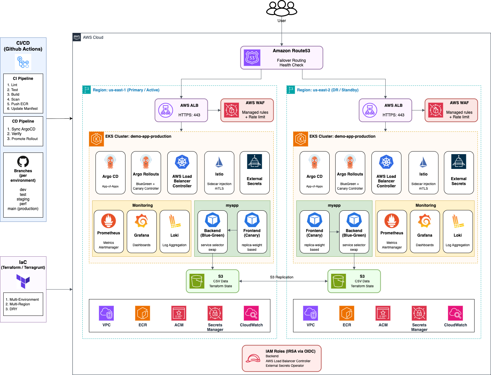

---

## Project Structure

```
my-devops-project/
├── app/                              # Application source code
│   ├── docker-compose.yaml           # Local dev with MinIO (S3-compatible)
│   ├── backend/
│   │   ├── app.py                    # Flask API: reads CSV from S3
│   │   ├── Dockerfile                # Python 3.12-slim + uv
│   │   └── pyproject.toml            # Dependencies (Flask, boto3)
│   └── frontend/
│       ├── app.py                    # Flask web UI: calls backend /api/data
│       ├── Dockerfile                # Python 3.12-slim + uv
│       ├── pyproject.toml            # Dependencies (Flask, requests)
│       └── templates/
│           └── index.html            # Jinja2 template rendering CSV table
│
├── helm-charts/                      # Helm charts (packaged with Argo CD)
│   ├── backend/                      # Backend chart (Blue-Green Rollout)
│   ├── frontend/                     # Frontend chart (Canary Rollout + Ingress)
│   └── alb-controller/               # ALB Controller wrapper chart
│
├── gitops/                           # Argo CD application manifests
│   ├── dev/                          # Development environment
│   │   └── us-east-1/
│   ├── test/                         # Test environment
│   │   └── us-east-1/
│   ├── staging/                      # Staging environment
│   │   └── us-east-1/
│   ├── perf/                         # Performance environment
│   │   └── us-east-1/
│   └── production/                   # Production (multi-region)
│       ├── us-east-1/                # Primary region
│       │   ├── root.yaml             # App-of-Apps root
│       │   ├── istio/                # Istio 1.24 service mesh
│       │   ├── external-secrets/     # External Secrets Operator
│       │   ├── monitoring/           # Prometheus + Grafana + Alertmanager
│       │   ├── loki/                 # Loki log aggregation
│       │   ├── grafana-external-secret/  # Grafana admin password
│       │   ├── argo-rollouts/
│       │   ├── aws-load-balancer-controller/
│       │   ├── backend/
│       │   └── frontend/
│       └── us-east-2/                # DR/secondary region
│
├── terraform/                        # Infrastructure as Code (Terragrunt)
│   ├── root.hcl                      # Shared config (provider, remote state)
│   ├── _envcommon/                   # Reusable environment-agnostic modules
│   │   ├── vpc.hcl                   # VPC with public/private subnets, NAT
│   │   ├── eks.hcl                   # EKS cluster + managed node groups
│   │   ├── ecr.hcl                   # ECR repositories
│   │   ├── iam.hcl                   # IAM roles for IRSA
│   │   ├── iam-service-accounts.hcl  # IRSA roles for K8s ServiceAccounts
│   │   ├── s3.hcl                    # S3 data source buckets
│   │   ├── waf.hcl                   # AWS WAF WebACL (managed rules + rate limit)
│   │   ├── secrets-manager.hcl       # Grafana admin password in Secrets Manager
│   │   ├── argocd.hcl                # Argo CD Helm deployment
│   ├── modules/
│   │   └── argocd/                   # Custom ArgoCD Terraform module
│   └── environments/                 # Per-environment configuration
│
└── .github/workflows/                # CI/CD pipelines
    ├── ci.yaml                       # Lint → Test → Build → Push ECR
    ├── cd.yaml                       # ArgoCD sync + Rollout promotion
    ├── terraform-apply.yaml          # Terraform apply workflow
    ├── terraform-destroy.yaml        # Terraform destroy workflow
    ├── pr-terraform-plan.yaml        # PR Terraform plan workflow
    └── rollback.yaml                 # Rollback workflow
```

---

## Documentation

| Document | Contents |
|----------|----------|
| [`docs/architecture.md`](docs/architecture.md) | Application stack, platform architecture, environments |
| [`docs/gitops.md`](docs/gitops.md) | ArgoCD App-of-Apps, sync waves, multi-source, Helm charts |
| [`docs/progressive-delivery.md`](docs/progressive-delivery.md) | Blue-Green + Canary strategies, rollback |
| [`docs/cicd.md`](docs/cicd.md) | CI/CD pipelines, triggers, image tagging, infra workflows |
| [`docs/terraform.md`](docs/terraform.md) | Terragrunt DRY pattern, modules, remote state, provisioning, WAF |
| [`docs/diagrams.md`](docs/diagrams.md) | Mermaid architecture and module dependency diagrams |

---

## Quick Start

```bash
# 1. Clone
git clone https://github.com/RaymonSun1230/my-devops-project.git && cd my-devops-project

# 2. Install tools
mise install

# 3. Provision infrastructure
cd terraform/environments/dev/us-east-1
terragrunt run-all apply

# 4. Configure kubectl
aws eks update-kubeconfig --region us-east-1 --name demo-app-dev

# 5. Port-forward ArgoCD
kubectl port-forward svc/argocd-server -n argocd 8080:443
# https://localhost:8080 — admin / (get from secret)

# 6. Bootstrap GitOps
kubectl apply -f gitops/dev/root.yaml
# ArgoCD auto-syncs (sync-wave order):
#   -2: Istio (service mesh)
#   -1: ALB Controller → External Secrets → Argo Rollouts → Monitoring (Prometheus+Grafana+Loki)
#    0: Backend → Frontend (with Istio sidecar injection)
```

---

## Local Development

```bash
cd app && docker compose up -d
```

| Service | URL |
|---------|-----|
| Frontend | http://localhost:8080 |
| Backend | http://localhost:7001 |
| MinIO Console | http://localhost:9001 (minioadmin / minioadmin) |

Upload `data.csv` to MinIO `demo-bucket` — the app reads from it just like production S3.

---

## Key Design Decisions

| Decision | Rationale |
|----------|-----------|
| **Terragrunt DRY** | `_envcommon/` modules → environments inherit & override only what differs |
| **App-of-Apps GitOps** | Single root → recursive sync → one `kubectl apply` per environment |
| **Multi-source ArgoCD** | Helm chart + env values as separate sources — clean separation |
| **Istio service mesh** | Sidecar injection for mTLS, traffic routing, and telemetry — no app code changes |
| **kube-prometheus-stack** | Prometheus + Grafana deployed together via a single Helm chart — curated dashboards and alert rules out of the box |
| **Loki for logs** | S3-backed log aggregation — Grafana datasource for full metrics → logs drill-down |
| **WAF at the edge** | AWS WAF WebACL attached to ALB — managed rule groups block OWASP top-10 before reaching the cluster |
| **External Secrets + Secrets Manager** | IRSA-backed, no K8s Secret manifests in git — Grafana admin password auto-generated and fetched at runtime |
| **Blue-Green + Canary** | Backend benefits from atomic cutover; frontend from gradual exposure |
| **IRSA (not static keys)** | OIDC-based pod identity — no secrets, auto-rotation |
| **Branch per environment** | `dev → test → staging → perf → main` — isolated promotion |
| **MinIO for local dev** | S3-compatible, zero cost, no AWS account needed |

---

## Current Scope

- GitOps workflows with Argo CD (App-of-Apps, sync waves, multi-source)
- Progressive delivery (Blue-Green + Canary via Argo Rollouts)
- Service mesh: Istio 1.24 with sidecar injection, mTLS, traffic management
- Monitoring stack: Prometheus (metrics) + Grafana (dashboards) + Loki (log aggregation)
- Edge security: AWS WAF WebACL with managed rule groups + rate limiting + SQLi protection
- Secrets management: External Secrets Operator reading from AWS Secrets Manager via IRSA
- Modular Infrastructure as Code (Terragrunt DRY pattern)
- CI/CD automation (GitHub Actions + OIDC to AWS)
- IRSA-based pod identity (IAM Roles for Service Accounts)
- Multi-environment governance (5 environments, 2 regions)
- Helm chart engineering (HPA, probes)

---

## Screenshots

| Screenshot | What to Capture |
|-----------|----------------|
| 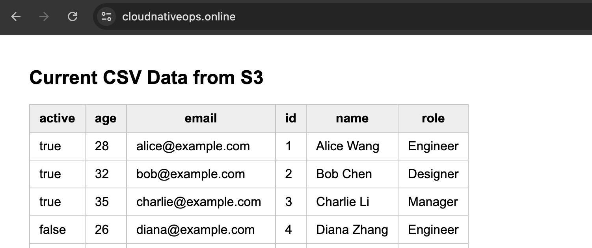 | Browser — `cloudnativeops.online` showing the CSV data viewer |
| 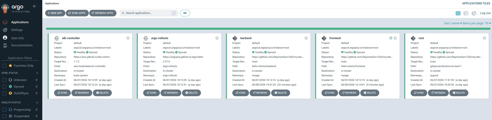 | ArgoCD dashboard — all apps Healthy + Synced |
| 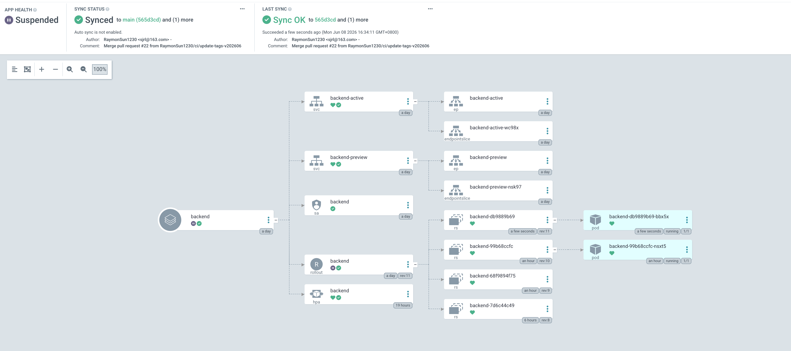 | Backend Blue-Green before promote — preview pods ready, waiting for promotion |
| 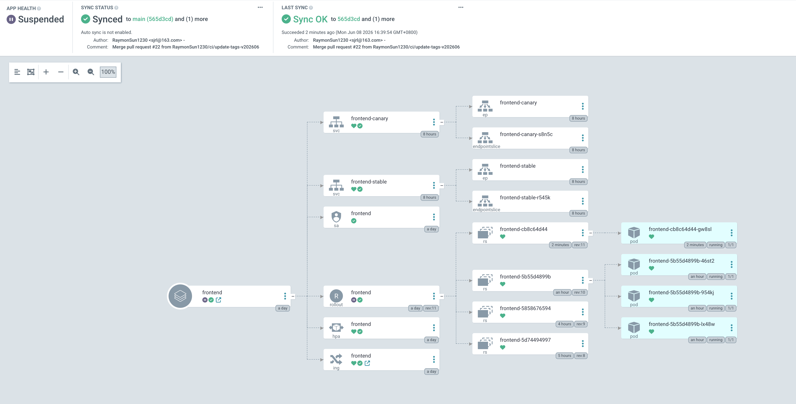 | Frontend Canary before promote — 25% canary, waiting at pause gate |
| 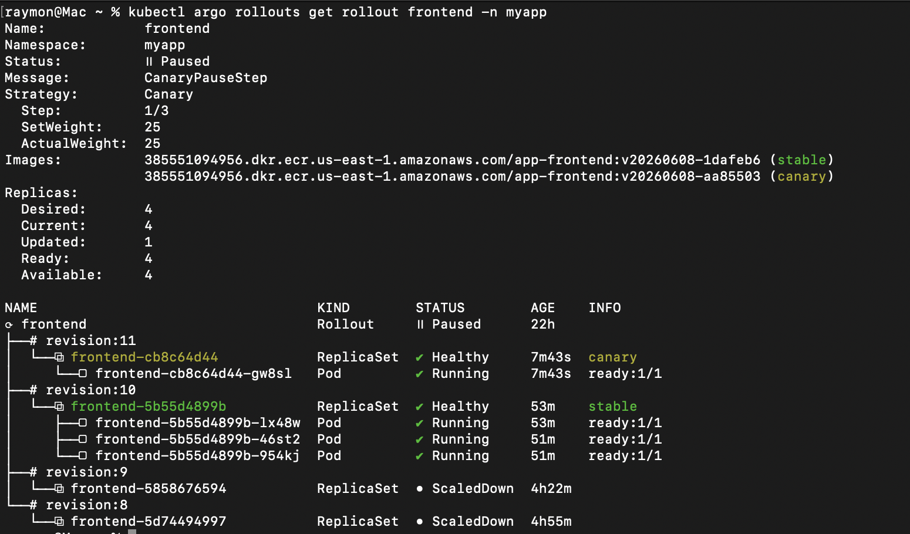 | `kubectl argo rollouts get rollout frontend` — canary rollout |
| 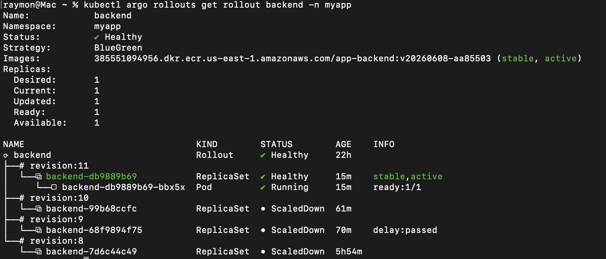 | `kubectl argo rollouts get rollout backend` — blue-green rollout |
| 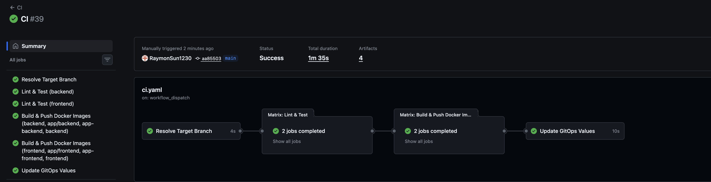 | GitHub Actions — CI pipeline success |
| 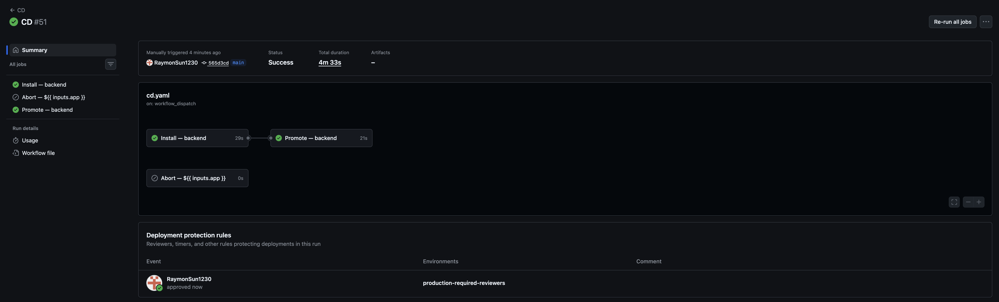 | GitHub Actions — CD pipeline success |
| 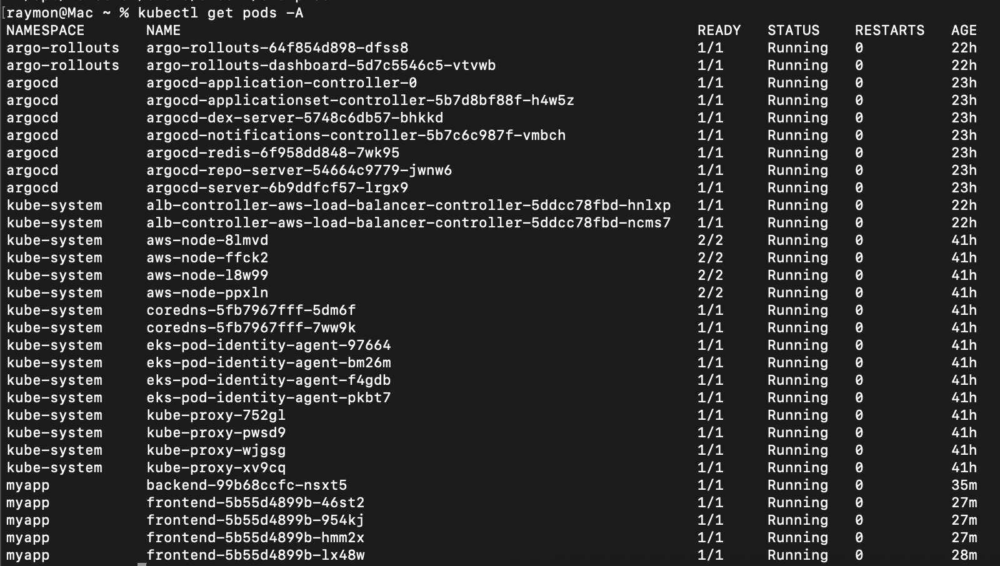 | `kubectl get pods -A` showing all namespaces (istio-system, monitoring, external-secrets, etc.) |
|  | Grafana — pre-built Kubernetes dashboards with Prometheus + Loki datasources |
|  | Grafana — Istio service mesh dashboards (traffic, errors, latency) |
| 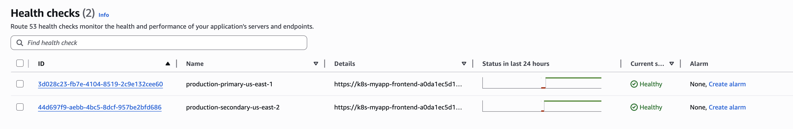 | AWS Console — Route53 health checks for us-east-1 and us-east-2, both healthy |
| 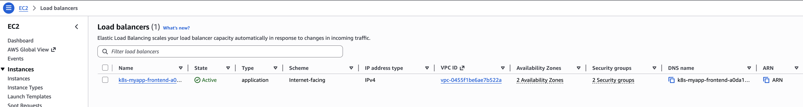 | AWS Console — ALB with WAF association and target groups |
| 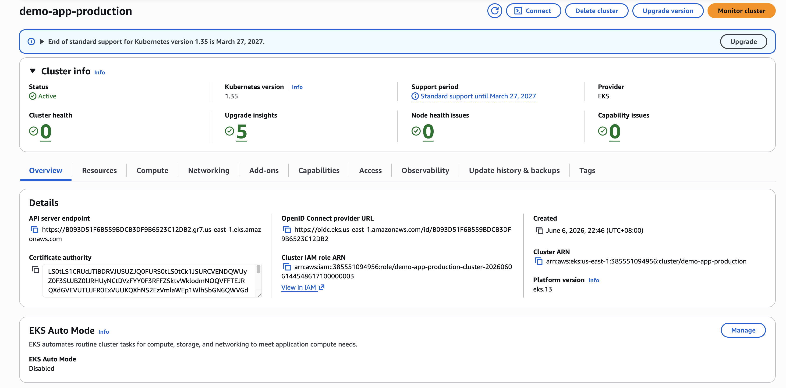 | AWS Console — EKS cluster overview |

---

## Why These Technologies?

This section explains the architectural reasoning behind each major technology choice — not just *what* was used, but *why*.

### Why Terragrunt (over raw Terraform)?

| Reason | Detail |
|--------|--------|
| **DRY multi-environment** | `_envcommon/` defines shared module configs once — each environment only overrides what differs (CIDRs, instance types, replica counts) |
| **Hierarchical config** | `root.hcl` → `_envcommon/` → environment `terragrunt.hcl` — clear inheritance chain |
| **`run-all` orchestration** | One command to plan/apply all modules in dependency order (VPC → EKS → IAM → ArgoCD) |
| **Auto-generated backends** | No copy-pasting `backend "s3"` blocks — `root.hcl` generates them from environment vars |

Without Terragrunt, you'd need wrapper scripts or duplicated Terraform configs across 5 environments × 6 modules = 30 copies.

### Why Argo CD + App-of-Apps?

| Reason | Detail |
|--------|--------|
| **Single bootstrap** | One `kubectl apply -f root.yaml` deploys an entire environment |
| **Sync waves** | Platform components (wave -1) deploy before apps (wave 1) — enforced ordering without external scripts |
| **Self-healing** | ArgoCD continuously reconciles — if someone manually deletes a resource, it's recreated within 3 minutes |
| **Multi-source apps** | Helm chart in one source, env values in another — no template duplication across environments |
| **Git as single source of truth** | Every change is auditable via `git log`; rollback = `git revert` |

### Why Argo Rollouts (over native Deployments)?

| Reason | Detail |
|--------|--------|
| **Blue-Green for APIs** | Backend gets atomic cutover — users never see mixed API versions |
| **Canary for frontends** | Frontend gets gradual 10%→50%→100% exposure — catch issues before full blast radius |
| **Built-in rollback** | `kubectl argo rollouts abort` / `undo` — instant revert without re-deploying old manifests |
| **Promotion gates** | Pause between steps lets you run smoke tests or wait for metrics before proceeding |

### Why IRSA (over static IAM credentials)?

| Reason | Detail |
|--------|--------|
| **No secrets in the cluster** | No `AWS_ACCESS_KEY_ID` in Kubernetes Secrets — pods get credentials via OIDC |
| **Least privilege per pod** | Each ServiceAccount gets its own IAM role — backend can only read S3, ALB controller can only manage LBs |
| **Auto-rotation** | AWS STS tokens expire and refresh automatically — no manual key rotation |
| **Auditable** | CloudTrail logs show which pod (via ServiceAccount) made each AWS API call |

### Why GitHub Actions (over Jenkins/self-hosted)?

| Reason | Detail |
|--------|--------|
| **OIDC to AWS** | No long-lived AWS credentials in GitHub Secrets — `aws-actions/configure-aws-credentials` with OIDC |
| **Matrix builds** | Backend + Frontend built in parallel via `strategy.matrix` |
| **workflow_dispatch** | Manual gates for higher environments — no accidental deployments to production |

### Why Istio (over raw Ingress + Service)?

| Reason | Detail |
|--------|--------|
| **Sidecar injection** | Transparent proxy injected at pod level — app code unchanged, zero-config mTLS between all services |
| **Traffic management** | Fine-grained routing (weighted splits, header-based, mirroring) — enables canary at the mesh layer, not just rollout level |
| **Observability** | Automatic metrics (4 golden signals), access logs, and distributed tracing — no app instrumentation required |
| **Uniform policy** | Authorization policies (mTLS, RBAC) enforced at the sidecar — consistent regardless of ingress controller |

Without Istio, mTLS requires app-level TLS libraries, traffic splitting needs a separate service mesh or ingress controller, and observability requires per-app metrics instrumentation.

### Why kube-prometheus-stack (Prometheus + Grafana)?

| Reason | Detail |
|--------|--------|
| **Batteries included** | Single Helm chart deploys Prometheus, Grafana, Alertmanager, kube-state-metrics, and node-exporter — pre-configured with Kubernetes dashboards and alert rules |
| **ServiceMonitors** | Prometheus auto-discovers scrape targets via labels — new services get scraped by adding a `ServiceMonitor` CR, no config reloads |
| **Grafana + Loki integration** | Grafana uses Prometheus as metrics datasource and Loki as logs datasource — click from a metric spike to the raw logs in one UI |
| **Community ecosystem** | 1000s of community dashboards on grafana.com — Istio, Kubernetes, EKS, ALB, etc. importable in one click |

### Why Loki (over Elasticsearch)?

| Reason | Detail |
|--------|--------|
| **S3-backed, no indexing** | Loki stores logs as compressed chunks in S3 — index-free design means no Elasticsearch cluster to manage |
| **Cost-effective** | Pay for S3 storage only — no hot/warm/cold tier management, no JVM heap sizing for log aggregation |
| **Grafana native** | LogQL is PromQL-inspired — same query language as Prometheus for metrics → logs correlation |
| **Promtail → Loki path** | Cluster log shipping via Promtail DaemonSet — minimal resource overhead, no separate log shipper infrastructure |

### Why AWS WAF (over cloud-agnostic alternatives)?

| Reason | Detail |
|--------|--------|
| **ALB-native integration** | WAF WebACL associates directly with the ALB — no reverse proxy or sidecar needed at the edge |
| **AWS-managed rule groups** | OWASP top-10 protection (CommonRuleSet, KnownBadInputs, IP reputation) maintained by AWS — zero rule authoring |
| **Rate limiting** | Per-IP rate-based rules block DDoS/brute-force at the edge — never reaches the cluster |
| **CloudWatch metrics** | Every rule emits CloudWatch metrics — monitor blocked requests, false positives, and attack patterns |

### Why External Secrets Operator (over native K8s Secrets)?

| Reason | Detail |
|--------|--------|
| **No secrets in git** | Grafana admin password lives in AWS Secrets Manager — never committed to the repository |
| **IRSA-backed** | External Secrets uses the same OIDC-based IRSA as the rest of the cluster — no AWS credentials stored anywhere |
| **Automatic synchronization** | Secret values are fetched and reflected as K8s Secrets automatically — if the value changes in Secrets Manager, the K8s Secret updates without a redeploy |
| **ClusterSecretStore** | A single `ClusterSecretStore` resource defines the AWS Secrets Manager provider — any namespace can reference it with an `ExternalSecret` |

---

## Platform Roadmap

The following enhancements are planned to evolve the platform toward a fully production-ready ecosystem. These are organized by capability domain — not as a "to-do list" but as a **platform evolution roadmap**.

### Observability

- **✅ Prometheus + Grafana** — `kube-prometheus-stack` deployed via ArgoCD, pre-built dashboards + Alertmanager
- **✅ Loki** — S3-backed log aggregation, Grafana datasource configured
- Distributed tracing with OpenTelemetry + Jaeger
- SLO/SLA dashboards per environment

### Networking & Ingress

- **✅ Route 53 custom domain** — live at [`cloudnativeops.online`](https://cloudnativeops.online)
- **✅ ACM HTTPS** — live, auto-redirects HTTP to HTTPS
- **✅ Multi-region DNS failover** — us-east-1 primary → us-east-2 DR
- **✅ AWS WAF** — WebACL with managed rule groups + rate limiting + SQLi protection (production)

### Security

- **✅ External Secrets Operator + AWS Secrets Manager** — Grafana admin password auto-generated and fetched via IRSA
- **✅ Istio service mesh** — mTLS, traffic routing, access logging
- OPA Gatekeeper / Kyverno for policy-as-code enforcement
- Network policies for namespace isolation

### Scalability & Cost

- Karpenter for dynamic, workload-aware node provisioning
- Spot instance node groups for non-critical workloads
- Workload right-sizing based on actual resource usage

### Progressive Delivery

- Automated rollout analysis using Prometheus metrics
- Metric-based auto-promotion / auto-rollback
- Advanced canary traffic routing (header-based, cookie-based)

### Reliability & Disaster Recovery

- Velero backup & restore for cluster state
- Multi-region failover automation
- Disaster recovery runbook & validation workflows

### Platform Engineering

- ArgoCD Notifications (Slack / Teams)
- Self-service developer portal (Backstage or Port)
- Golden path application templates

---

## Prerequisites

| Tool | Version | Purpose |
|------|---------|---------|
| Terraform | 1.15.5 | Infrastructure provisioning |
| Terragrunt | 1.0.7 | Terraform DRY wrapper |
| kubectl | Latest | Kubernetes CLI |
| AWS CLI | Latest | EKS authentication |
| Helm | 3.x | Chart packaging |
| Docker | Latest | Container builds |
| Python | 3.12+ | Local dev |
| istioctl | 1.24.x | Istio service mesh management (optional) |
| kubectl-argo-rollouts | Latest | Rollout promotion & abort (optional) |
| mise | Latest | Tool version manager (optional) |

```toml
# mise.toml
[tools]
terragrunt = "1.0.7"
terraform = "1.15.5"
```

---

## License

MIT — for educational and portfolio purposes.