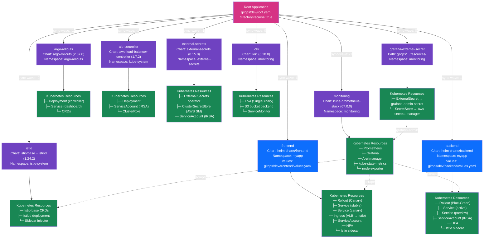
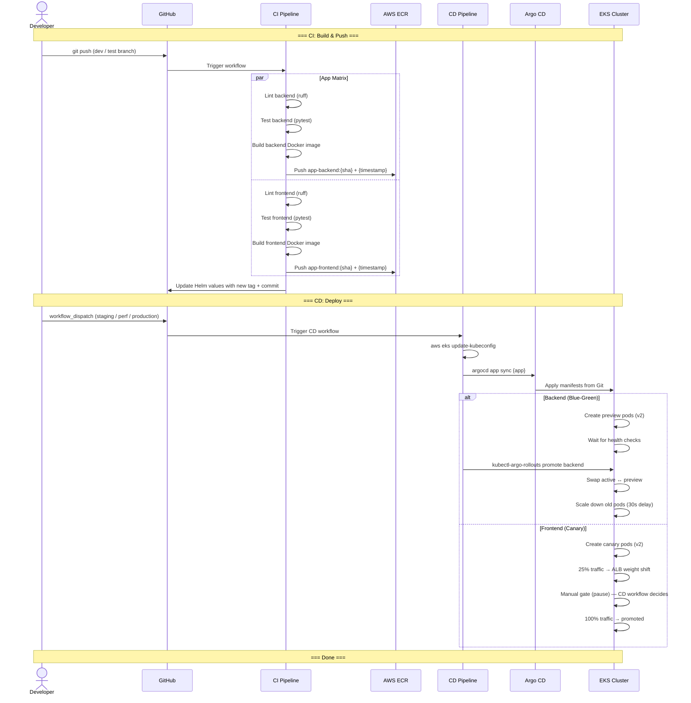
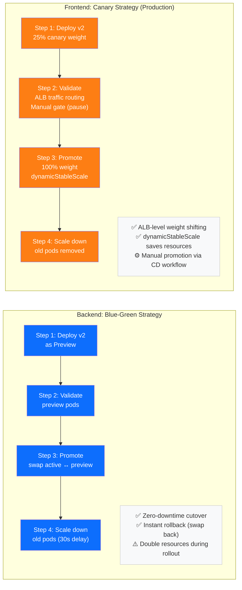
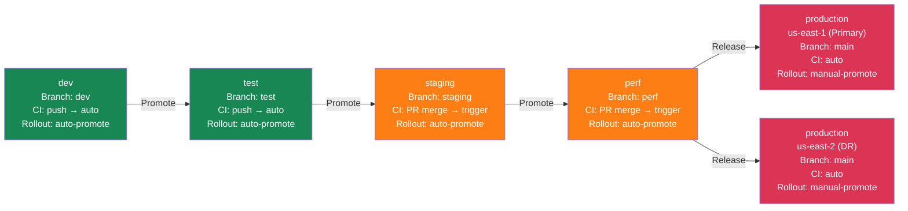
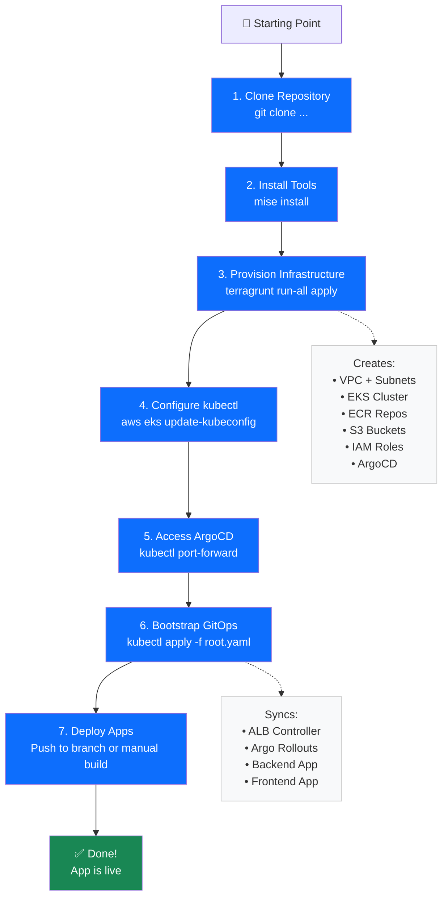

# Architecture Diagrams

This file contains all diagrams referenced in the [README.md](../README.md). Each diagram is written in **Mermaid** syntax and can be rendered on [mermaid.live](https://mermaid.live), GitHub, or any Mermaid-compatible viewer.

---

## 1. Architecture Overview

```mermaid
graph TB
    subgraph "CI/CD Layer - GitHub Actions"
        CI_WF["CI Pipeline<br/>Lint (ruff) → Test (pytest) → Build → Push ECR"]
        CD_WF["CD Pipeline<br/>ArgoCD Sync → Promote/Abort Rollout"]
        TF_WF["Terraform Workflows<br/>Plan / Apply / Destroy"]
    end

    subgraph "AWS Cloud"
        subgraph "Region: us-east-1 / us-east-2"
            subgraph "Networking Layer"
                VPC["VPC<br/>CIDR: 10.x.0.0/16"]
                PUB_SUB["Public Subnets<br/>ALB Ingress"]
                PRIV_SUB["Private Subnets<br/>EKS Worker Nodes"]
                NAT["NAT Gateway"]
                IGW["Internet Gateway"]
            end

            subgraph "EKS Cluster - demo-app-{env}"
                subgraph "Platform Namespaces"
                    direction TB
                    ISTIO["Istio<br/>istio-system namespace<br/>Sidecar injection + mTLS"]
                    ARGOCD["Argo CD<br/>argocd namespace<br/>GitOps Controller"]
                    ROLLOUTS["Argo Rollouts<br/>argo-rollouts namespace<br/>Canary + Blue-Green controller"]
                    ALBC["AWS LB Controller<br/>kube-system namespace<br/>Ingress Provisioning"]
                    EXT_SEC["External Secrets<br/>external-secrets namespace<br/>ClusterSecretStore → Secrets Manager"]
                end

                subgraph "Monitoring Namespace"
                    PROM["Prometheus<br/>Metrics + Alertmanager"]
                    GRAFANA["Grafana<br/>Dashboards<br/>pw: Secrets Manager"]
                    LOKI["Loki<br/>Log Aggregation<br/>S3-backed"]
                end

                subgraph "Application Namespace: myapp"
                    direction LR
                    
                    subgraph "Frontend Rollout (Canary)"
                        FE_STABLE["frontend-stable<br/>Service (ClusterIP)"]
                        FE_CANARY["frontend-canary<br/>Service (ClusterIP)"]
                        FE_POD_V1["Frontend v1<br/>4 replicas<br/>+ Istio sidecar"]
                        FE_POD_V2["Frontend v2<br/>Canary pods<br/>+ Istio sidecar"]
                    end

                    subgraph "Backend Rollout (Blue-Green)"
                        BE_ACTIVE["backend-active<br/>Service (ClusterIP)"]
                        BE_PREVIEW["backend-preview<br/>Service (ClusterIP)"]
                        BE_POD_V1["Backend v1<br/>Active pods<br/>+ Istio sidecar"]
                        BE_POD_V2["Backend v2<br/>Preview pods<br/>+ Istio sidecar"]
                    end
                end
            end

            subgraph "AWS Services"
                ECR_BE["ECR<br/>app-backend"]
                ECR_FE["ECR<br/>app-frontend"]
                S3_DATA["S3<br/>data-source bucket<br/>CSV file storage"]
                S3_REP["S3 Replication<br/>Cross-region sync<br/>us-east-1 → us-east-2"]
                IAM_IRSA["IAM Roles<br/>IRSA for Service Accounts"]
                IAM_S3REP["IAM Role<br/>S3 Replication"]
                SM["Secrets Manager<br/>grafana-admin-{env}"]
                R53["Route 53<br/>DNS (production)"]
                ACM["ACM<br/>SSL/TLS (production)"]
            end

            WAF["AWS WAF<br/>WebACL<br/>Managed rules + Rate limit"]
            ALB["AWS ALB<br/>HTTPS :443<br/>WAF Association"]
        end
    end

    subgraph "Version Control"
        GIT["GitHub Repository<br/>my-devops-project"]
        BRANCHES["Branches<br/>dev | test | staging | perf | main"]
    end

    subgraph "External"
        USER["End User<br/>Browser"]
        DEV["Developer<br/>git push / workflow_dispatch"]
    end

    %% User Traffic Flow
    USER -->|"https://cloudnativeops.online"| ALB
    ALB -.->|"Associated"| WAF
    ALB -->|"ALB Ingress<br/>→ frontend-stable"| FE_STABLE
    FE_POD_V1 -->|"GET /api/data"| BE_ACTIVE
    BE_POD_V1 -->|"boto3 get_object()"| S3_DATA
    S3_DATA -.->|"Cross-region replication"| S3_REP
    IAM_S3REP -.->|"Trust Policy"| S3_REP

    %% GitOps Flow
    DEV -->|"git push"| GIT
    GIT -->|"Webhook / 3min Poll"| ARGOCD
    ARGOCD -->|"Sync manifests"| ROLLOUTS
    ARGOCD -->|"Sync manifests"| ALBC
    ARGOCD -->|"Sync manifests"| ISTIO
    ARGOCD -->|"Sync manifests"| EXT_SEC
    ARGOCD -->|"Sync manifests"| PROM
    ARGOCD -->|"Sync manifests"| GRAFANA
    ARGOCD -->|"Sync manifests"| LOKI

    %% Rollout Control Flow
    ROLLOUTS -.->|"controls canary<br/>(replica-weight)"| FE_STABLE
    ROLLOUTS -.->|"controls canary"| FE_CANARY
    ROLLOUTS -.->|"controls blue-green<br/>(selector swap)"| BE_ACTIVE
    ROLLOUTS -.->|"controls blue-green"| BE_PREVIEW

    %% Istio Sidecar Flow
    ISTIO -.->|"sidecar mTLS + metrics"| FE_POD_V1
    ISTIO -.->|"sidecar mTLS + metrics"| FE_POD_V2
    ISTIO -.->|"sidecar mTLS + metrics"| BE_POD_V1
    ISTIO -.->|"sidecar mTLS + metrics"| BE_POD_V2

    %% Monitoring Flow
    PROM -.->|"scrape (ServiceMonitor)"| FE_POD_V1
    PROM -.->|"scrape (ServiceMonitor)"| BE_POD_V1
    PROM -.->|"scrape (ServiceMonitor)"| ISTIO
    GRAFANA -.->|"datasource"| PROM
    GRAFANA -.->|"datasource"| LOKI
    GRAFANA -.->|"admin password"| EXT_SEC
    EXT_SEC -.->|"GetSecretValue"| SM

    %% CI/CD Flow
    CI_WF -->|"docker push"| ECR_BE
    CI_WF -->|"docker push"| ECR_FE
    CI_WF -->|"Update Helm values + commit"| GIT
    CD_WF -->|"argocd app sync"| ARGOCD
    CD_WF -->|"kubectl-argo-rollouts promote"| ROLLOUTS

    %% IaC Flow
    TF_WF -->|"terraform apply"| VPC
    TF_WF -->|"terraform apply"| ECR_BE
    TF_WF -->|"terraform apply"| S3_DATA
    TF_WF -->|"terraform apply"| IAM_IRSA
    TF_WF -->|"terraform apply"| IAM_S3REP
    TF_WF -->|"terraform apply"| ACM
    TF_WF -->|"terraform apply"| R53
    TF_WF -->|"terraform apply"| WAF
    TF_WF -->|"terraform apply"| SM

    %% IRSA Trust
    IAM_IRSA -.->|"OIDC Trust"| BE_POD_V1
    IAM_IRSA -.->|"OIDC Trust"| ALBC
    IAM_IRSA -.->|"OIDC Trust"| EXT_SEC

    %% Styling
    classDef aws fill:#FF9900,color:#000,stroke:#232F3E
    classDef k8s fill:#326CE5,color:#fff,stroke:#326CE5
    classDef cicd fill:#2088FF,color:#fff,stroke:#0366D6
    classDef git fill:#333,color:#fff,stroke:#666
    classDef user fill:#28A745,color:#fff,stroke:#1E7E34
    classDef security fill:#EF4444,color:#fff,stroke:#DC2626

    class VPC,PUB_SUB,PRIV_SUB,NAT,IGW,ALB,S3_DATA,S3_REP,ECR_BE,ECR_FE,IAM_IRSA,IAM_S3REP,R53,ACM,SM aws
    class ISTIO,ARGOCD,ROLLOUTS,ALBC,EXT_SEC,PROM,GRAFANA,LOKI,FE_STABLE,FE_CANARY,BE_ACTIVE,BE_PREVIEW k8s
    class CI_WF,CD_WF,TF_WF cicd
    class GIT,BRANCHES git
    class USER,DEV user
    class WAF security
```

---

## 2. Terraform Module Dependency Graph

```mermaid
graph TD
    ROOT["root.hcl<br/>Provider + Remote State"]

    subgraph "Environment Common"
        VPC_HCL["vpc.hcl"]
        EKS_HCL["eks.hcl"]
        ECR_HCL["ecr.hcl"]
        IAM_HCL["iam.hcl"]
        IAM_SA_HCL["iam-service-accounts.hcl"]
        S3_HCL["s3.hcl"]
        WAF_HCL["waf.hcl"]
        WAF_HCL["waf.hcl"]
        KMS_HCL["kms.hcl"]
        SM_HCL["secrets-manager.hcl"]
        ACM_HCL["acm.hcl"]
        R53_HCL["route53.hcl"]
        ARGOCD_HCL["argocd.hcl"]
    end

    subgraph "Environment Config"
        ENV["environment.hcl<br/>account_id + env name"]
        REGION["region.hcl<br/>aws_region (per region)"]
    end

    subgraph "Global Resources (per-environment)"
        IAM_ALB["IAM Role<br/>ALB Controller IRSA<br/><i>dev/global/iam/alb-controller</i>"]
        IAM_BE["IAM Role<br/>Backend S3 IRSA<br/><i>dev/global/iam/app-backend</i>"]
        IAM_ES["IAM Role<br/>External Secrets IRSA<br/><i>dev/global/iam/external-secrets</i>"]
        IAM_S3REP["IAM Role<br/>S3 Replication<br/><i>production/global/iam/s3-replication</i>"]
        R53_RES["Route53<br/>DNS Records<br/><i>production/global/route53</i>"]
    end

    subgraph "Regional Resources (us-east-1 / us-east-2)"
        VPC_RES["VPC<br/>Subnets + NAT + IGW"]
        EKS_RES["EKS Cluster<br/>Node Groups + Addons"]
        ECR_RES["ECR Repos<br/>app-backend + app-frontend"]
        ACM_RES["ACM<br/>SSL Certificates"]
        S3_RES["S3 Bucket<br/>data-source<br/>SSE-KMS encrypted"]
        KMS_RES["KMS Key<br/>alias/s3-{env}-{region}<br/>S3 + ECR + Secrets Manager"]
        WAF_RES["WAF WebACL<br/>Managed rules + Rate limit"]
        SM_RES["Secrets Manager<br/>Grafana admin password<br/>KMS encrypted"]
        ARGOCD_RES["Argo CD<br/>Helm Release"]
    end

    ENV --> ROOT
    REGION --> ROOT

    ROOT --> VPC_HCL
    ROOT --> EKS_HCL
    ROOT --> ECR_HCL
    ROOT --> IAM_HCL
    ROOT --> IAM_SA_HCL
    ROOT --> S3_HCL
    ROOT --> WAF_HCL
    ROOT --> KMS_HCL
    ROOT --> SM_HCL
    ROOT --> ACM_HCL
    ROOT --> R53_HCL
    ROOT --> ARGOCD_HCL

    VPC_HCL --> VPC_RES
    EKS_HCL -->|"depends_on: VPC"| EKS_RES
    ECR_HCL --> ECR_RES
    KMS_HCL --> KMS_RES

    IAM_SA_HCL -->|"depends_on: EKS (OIDC)"| IAM_ALB
    IAM_SA_HCL -->|"depends_on: EKS (OIDC)"| IAM_BE
    IAM_SA_HCL -->|"depends_on: EKS (OIDC)"| IAM_ES
    IAM_HCL --> IAM_S3REP
    KMS_RES -.->|"encrypts"| S3_RES
    KMS_RES -.->|"encrypts"| ECR_RES
    KMS_RES -.->|"encrypts"| SM_RES
    WAF_HCL --> WAF_RES
    SM_HCL --> SM_RES
    ACM_HCL --> ACM_RES
    R53_HCL -->|"depends_on: ACM"| R53_RES
    S3_HCL -->|"prod: depends_on IAM S3 Rep"| S3_RES
    ARGOCD_HCL -->|"depends_on: EKS"| ARGOCD_RES

    VPC_RES -.-> EKS_RES
    EKS_RES -.-> IAM_ALB
    EKS_RES -.-> IAM_BE
    EKS_RES -.-> IAM_ES
    EKS_RES -.-> ARGOCD_RES
    IAM_S3REP -.-> S3_RES
    ACM_RES -.-> R53_RES

    classDef input fill:#6F42C1,color:#fff
    classDef common fill:#D63384,color:#fff
    classDef global fill:#0DCAF0,color:#000
    classDef regional fill:#0D6EFD,color:#fff
    classDef security fill:#EF4444,color:#fff

    class ENV,REGION input
    class VPC_HCL,EKS_HCL,ECR_HCL,IAM_HCL,IAM_SA_HCL,S3_HCL,WAF_HCL,KMS_HCL,SM_HCL,ACM_HCL,R53_HCL,ARGOCD_HCL common
    class IAM_ALB,IAM_BE,IAM_ES,IAM_S3REP,R53_RES global
    class VPC_RES,EKS_RES,ECR_RES,ACM_RES,S3_RES,WAF_RES,SM_RES,ARGOCD_RES regional
    class KMS_RES security
```

---

## 3. ArgoCD App-of-Apps Tree

---

## 4. CI/CD Pipeline Flow

---

## 5. Progressive Delivery Strategy Comparison

---

## 6. Environment Promotion Path

---

## 7. Quick Start Flow

---

## How to Render

These diagrams use **Mermaid** syntax. You can render them in any of the following ways:

1. **GitHub**: Mermaid diagrams render natively in GitHub markdown files
2. **VS Code**: Install the "Markdown Preview Mermaid Support" extension
3. **[mermaid.live](https://mermaid.live)**: Paste any diagram code to render and export as PNG/SVG
4. **CLI**: `npx @mermaid-js/mermaid-cli -i diagram.mmd -o diagram.png`
